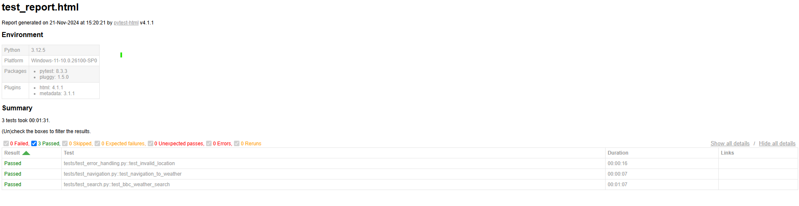

# **QA Portfolio Project**

Welcome to my QA Portfolio repository! This project showcases my skills in **manual testing**, **test automation**, **API testing**, and **bug reporting**, using best practices and tools for quality assurance.

---

## **Table of Contents**
1. [Project Overview](#project-overview)
2. [Technologies and Tools Used](#technologies-and-tools-used)
3. [Manual Testing](#manual-testing)
4. [Automation Testing](#automation-testing)
5. [API Testing](#api-testing)
6. [Selenium Testing Project](#selenium-testing-project)
7. [How to Run Automation Scripts](#how-to-run-automation-scripts)
8. [Contact Information](#contact-information)
9. [Screenshots](#Screenshots)

---

## **Project Overview**

This repository demonstrates my capabilities in:
- Writing test cases for web applications.
- Documenting bugs effectively.
- Automating functional tests using Selenium and Python.
- Performing API testing using Postman.
- Following QA methodologies to ensure software quality.

---

## **Technologies and Tools Used**

- **Manual Testing**: Test case design, bug reporting, and exploratory testing.
- **Automation Testing**: Selenium, Python, pytest.
- **API Testing**: Postman.
- **Version Control**: Git, GitHub.
- **Tools**: ChromeDriver, Browser DevTools.

---

## **Manual Testing**

- **Bug Reports**: Detailed bug reports with steps to reproduce, expected and actual results, and severity levels.  
  - **Location**: `manual-testing/bug-reports/`
- **Screenshots**: Screenshots illustrating bugs and issues.  
  - **Location**: `manual-testing/screenshots/`
- **Navigation Tests**: Validating links and buttons lead to the correct pages.  
  - **Location**: `manual-testing/navigation_tests_BBC.xlsx`

---

## **Automation Testing**

- **Scripts**: Automated tests for navigation, error handling, and search functionality on the BBC Weather website.  
  - **Location**: `automation-testing`
- **Framework**: Selenium WebDriver and pytest for browser automation with Python.

---

## **API Testing**

This repository contains Postman tests for the BBC Weather API.

- **Postman Collection**: [BBC Weather API Testing](/API%20Testing/BBC_Weather_API_Testing.postman_collection.json)
- **Documentation**: [API Testing Documentation](https://go.postman.co/mission-architect-24640010/workspace/api-testing/documentation/35342416-187bd2bf-07f3-4a5f-b086-5939b2f35b2b?entity=request-cf69d7f6-689e-4664-834a-38f41c031912)

---

## **Selenium Testing Project**

This project contains automated tests for the BBC Weather website using Selenium and Pytest.

### **Features**
- Automated navigation, search, and error handling tests.
- HTML reports generated using pytest.

### **Prerequisites**

Before running the tests, ensure you have the following installed:
- Python 3.x
- Pip (Python package manager)

### **Setup**

1. Clone the repository:
   ```bash
   git clone https://github.com/fanoctism/testing-practice.git
   cd testing-practice/Selenium
   ```

2. Set up a virtual environment:
   ```bash
   python -m venv .venv
   ```

3. Activate the virtual environment:
   - On Windows:
     ```bash
     .venv\Scripts\activate
     ```
   - On macOS/Linux:
     ```bash
     source .venv/bin/activate
     ```

4. Install required dependencies:
   ```bash
   pip install -r requirements.txt
   ```

### **Running the Tests**

To execute all tests:
```bash
pytest tests/
```

To generate an HTML report:
```bash
pytest tests/ --html=reports/report.html --self-contained-html
```
---

## **Contact Information**

[Mergen Durdyyev](mailto:mergen.d@gmail.com)  
[LinkedIn Profile](https://www.linkedin.com/in/mergen-can-durdyyev/)

---

## **Screenshots**

